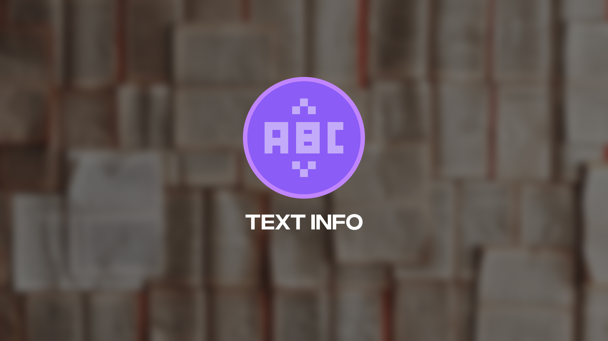

# Text Info – SMS Character Counter & Encoding Checker  

**Text Info** is a clean and smart web app that helps you count characters, words, symbols, and more while checking the SMS encoding type in real time. It’s perfect for anyone composing messages that need to stay within SMS limits and encoding standards.

---

## 📌 Description

**Text Info** is an intuitive tool for composing SMS messages efficiently. It gives you **live stats** on your message — showing character count, words, symbols, and whether your message uses **GSM 7** or **Unicode** encoding, which directly impacts cost and deliverability.

The interface is modern, minimal, responsive, and accessibility-friendly — with a smooth dark mode by default.

---

## ✨ Features

- 🔢 **Real-time counting** of characters, words, spaces, letters, and symbols  
- 🧠 **Automatic encoding detection** — GSM 7 or Unicode  
- 🧮 **SMS parts calculation** and remaining character tracking  
- 🌙 **Dark mode UI** with vibrant theme support  
- 📱 **Responsive design** for mobile & desktop  
- ♿ **Accessibility-aware markup & keyboard support**  
- 🚫 **No tracking or cookies** – simple & privacy-respecting

---

## 🔧 Technologies Used

- HTML5, CSS3, JavaScript (ES6+)
- Tailwind CSS (utility-first framework)
- Font Awesome (icons)
- Google Fonts (Poppins)

---

## 🚀 Usage

1. Open `index.html` in your browser.
2. Start typing in the textarea.
3. Instantly see:
   - Character and word stats
   - Encoding type (GSM 7 / Unicode)
   - SMS part breakdown and remaining space

---

## ♿ Accessibility & SEO

- Semantic HTML with ARIA labels  
- Keyboard and screen reader-friendly  
- Mobile-first responsive layout  
- Optimized heading structure for SEO

---

## License

MIT License — use and modify freely.  
Please credit if you share or reuse.

---

**Made with** ❤️ **by Harsh Trivedi**   
*For questions or customizations, open an issue or contact [Harsh Trivedi](https://harsh98trivedi.github.io/links) directly.*